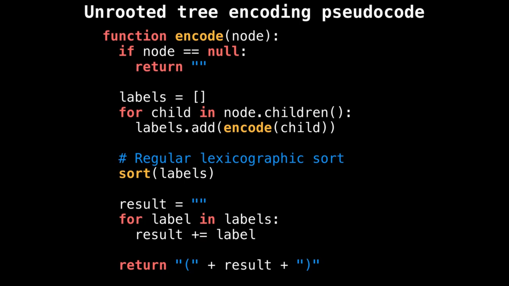

# DS/Algo Theory

Created: July 29, 2021 1:07 AM

# **Data structures**

- **Array**
    - What are static arrays?
        
        fixed container, indexable, sequential storage. Used in IO routines, buffers, dynamic prog etc.
        
    - What are dynamic arrays?
    - Time complexities - insertion, deletion, search, modification?
- **Linked List**
    - Time complexities - insertion, deletion, search, modification?
        
        Insertion at head: $O(1)$. Search: $O(n)$. Deletion: $O(n)$  
        
    - What all to remember in LL codes?
        - How to delete node?
        - How to swap nodes without swapping data? (corner cases)?
        - How to remove duplicates in sorted LL?
            
            ```jsx
            while (current->next != NULL)
                {
                /* Compare current node with next node */
                if (current->data == current->next->data)
                {
                    /* The sequence of steps is important*/       
                    next_next = current->next->next;
                    free(current->next);
                    current->next = next_next;
                }
                else /* This is tricky: only advance if no deletion */
                {
                    current = current->next;
                }
                }
            ```
            
    
- **Stack**
    - Time complexities - insertion, deletion etc.?
- **Queue**
    - Queue is used for BFS.
    - Time complexities - insertion, deletion?
- **Tree**
    - **Binary tree**
    - **Binary search tree**
    - **Fenwick tree**
    - **Red black/AVL tree**
- **Map**
    - Time complexities - insertion, deletion etc.?
- **Set**
    - Time complexities - insertion, deletion etc.?
- **Priority queue**
    - Time complexities - insertion, deletion etc.?
    - PQs are abstract data type, heap is a way of implementing them.
    - Applications?
        
        Djikstra algorithm, best first search, huffman coding, MST algos etc.
        
- **Heap**
    - All heaps must be trees i.e. cannot contain cycles.
    - Heap time complexities - construction and heapify?
    - Why is construction time THAT?
- **String**

# Algorithms

- **Union find**
    - Applications?
        
        Used in Kruskal's MST algo, LCA in trees, img processing, network connectivity
        
    - Time complexities?
        
        Union time construction: $O(n)$, Union, find, get comp. size, check if connected: $\alpha (n)$ (Amortized constant time - occurs when we use path compression)
        
    - Union: To unify 2 elements find root nodes of both. If they're different, make them same. Find: Keep going through parent nodes of given node until a self loop (node that is parent of itself) is reached - that's the root node of this given node.
    - What is path compression?
        
        When we find the root of a node, and we set the parent of that node as this root itself so we don't have to keep traversing again and again to find root.
        
    - What is union by rank?
        
        While doing union, we attach the lower ranked set to the higher ranked one - this is called union by rank. Rank can be determined by number of nodes etc.
        
- **Sorting algorithms**
    - **Bubble sort**
    - **Insertion sort**
    - **Merge sort**
    - **Heap sort**
    - **Selection sort**
    - **Quick sort**
    - **Radix sort**
    - **Counting sort**
- **Graph: representations and special graphs**
    
    *Special graphs*
    
    - What are trees?
        
        Undirected graph with no cycles. Also a connected graph with n nodes and n - 1 edges.
        
    - What are rooted trees?
        
         Trees with designated root node. **Arborescence** trees if edges point away from root, **anti-arborescence** for vice versa.
        
    - What are DAGs?
        
        Directed acyclic graph. Plays very important role in many fields.
        
    - What are bipartite graphs?
        
        Those whose edges can be split into two groups. Also called two-colourable.
        
    - What is complete graph?
        
        Unique edge between every pair of nodes.
        
    - What are isomorphic graphs?
        
        Two graphs are said to be isomorphic if there exists a bijection such that all the nodes and edges in one graph can be mapped to the other. Checking if two graphs are isomorphic is an NP hard problem, but there exist polynomial time solutions for spl graphs like trees.
        
    
    *Graph Representation*
    
    - What is adjacency matrix?
        
        Cell  $m[i][j]$ represents edge weight between node i and j. Very efficient storage for dense graphs, fast and simple. But iteration takes time
        
    - What is adjacency list?
        
        Map from nodes to list of edges. Fast iteration and efficient storage, but complex repr.
        
    - What is edge list?
        
        List of edges. Very simple, space and time efficient, but edge weight lookup is O(E) and less efficient for dense graphs.
        
- **Graph: algorithms**
    - DFS
        - Time complexity?
            
            $O(V+E)$
            
    - BFS
        - Time complexity?
            
            $O(V+E)$
            
    - Identifying Isomorphic Trees
        
        
        
    - Topological Sort
        - What is topological ordering?
            
            An ordering of nodes in a directed graph where for each directed edge from node A to node B, A appears before B in the ordering.
            
        - What is topological sort?
            
            This algorithm returns a topological ordering in $O(V+E)$ time. The idea is  that you start with any node, and DFS visit all the unvisited nodes that have an edge from this node. Then backtrack and put each of these visited nodes in the current path in REVERSE ordering in your final sort. Once these paths are finished for the current node, pick another node and so on.
            
        - Kahn's algorithm for topological sorting
            
            In this you first calculate in degree of every node and store it in an array, then have a queue in which you keep pushing nodes with zero in degree (i.e. those with no incoming edges), and subtract 1 from the in degrees of the nodes with edges towards them. The nodes in the queue are then popped and put in the final ordering, and then the next nodes with 0 in degree are pushed, and so on.
            
    - Shortest and Longest paths
        
        Both of these can be found out in a DAG in $O(V+E)$ time. The longest path one is NP hard in general graphs, but not so for DAGs: we can multiply each edge weight by -1, find shortest path, then multiply it all again by -1.
        
    - Dijkstra's algorithm
        1. For Single Source Shortest Paths in a graph with non-negative edge weights. 
        2. Has multiple ways of implementation - lazy (in which outdated edges aren't removed from the priority queue so they're constantly iterated on), eager (outdated edges removed cuz indexed priority queue), Fibonacci Heap and D-ary Heap.
        3. Fibonacci heap is the fastest, gives $O(E + VlogV)$ time, but very difficult to implement. D-ary heaps are best, the ideal degree in these is $E/V$.
    - Bellman Ford
        - Why is this not preferred over Djikstra?
            
            Much slower: complexity of $O(EV)$. Used for negative edge weights.
            
    - What is a strongly connected component?
        
        A directed graph is strongly connected if there is a path between all pairs of vertices. A strongly connected component (SCC) of a directed graph is a maximal strongly connected subgraph.
        
    - Kosaraju Strongly Connected Components Algorithm
        
        First do a DFS, and push element to stack after all its adj vertices have been visited. Reverse the graph. Then do another DFS: pop each element from stack, visit all its adj vertices and print, do until stack is empty. Time complexity: $O(V + E)$
        
- **DP**
- **Backtracking**
- **Greedy**
- **Branch and bound**
- **Sliding Window**
    
    Remember: Sliding window cannot be used if input is negative
    

# Miscellaneous

- Catalan number
    
    ```python
    C = 1
    for i in range(0, n):
        C = C * 2*(2*i+1)/(i+2)
    return int(C)
    ```