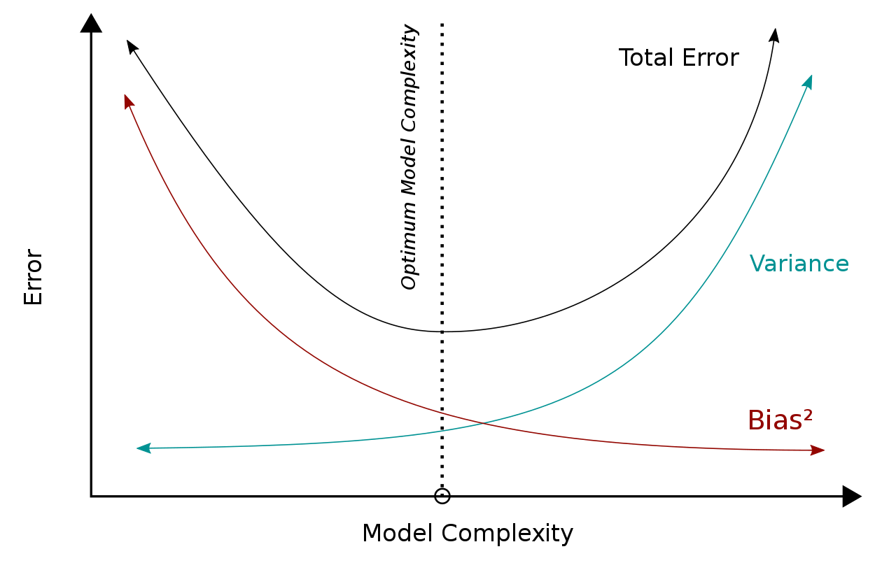

# Machine Learning

## 1. Metrics

- What are type 1 and type 2 errors?
    
    Type 1 is false positive: the error of rejecting a null hypothesis when it is actually true. In other words, this is the error of accepting an alternative hypothesis (the real hypothesis of interest) when the results can be attributed to chance.
    
    Type II error, also known as a "false negative": the error of not rejecting a null hypothesis when the alternative hypothesis is the true state of nature. In other words, this is the error of failing to accept an alternative hypothesis when you don't have adequate power.
    
- What is the relationship between sample size and margin of error?
    
    Often, the most practical way to decrease the margin of error is to increase the sample size. Usually, the more observations that you have, the narrower the interval around the sample statistic is. Thus, you can often collect more data to obtain a more precise estimate of a population parameter.
    
    Beside this, why does the margin of error increase as the confidence level increases?
    
    The margin of error increases as the level of confidence increases because the larger the expected proportion of intervals that will contain the parameter, the larger the margin of error. 
    
- When should Leave One Out CV be used over Kfold?
    
    KNN!
    
- Tradeoffs of CV and dev set testing?
    
    the main advantage to cross validation over development data is robustness. The main advantage of development data is speed.
    
- When hypothesis testing and when CV?
    
    Hypothesis testing: when we use parametric tests like paired t-test, they make assumptions. t-test assumes data is normally distributed. One disadvantage to the t-test is that it cannot easily be applied to evaluation metrics like f-score. This is because f-score is a computed over an entire test set and does not decompose into a set of individual errors. This means that the t-test cannot be applied. Hence CV.
    
- t-test?
    
    Let a1...aN be the errors algo A made on each training sample. b1...bN of algo B. We calculate $\mu_A, \mu_B$ and normalize the terms as $\hat{a} = a - \mu_A$. Then the statistic is given by 
    $(\mu_A - \mu_B ) \sqrt[][\frac{N(N - 1)}{\sum_n (\hat{a_n} - \hat{b_n})^2}]$
    
- What is Perplexity?
    
    Metric for evaluating language models, lower the better. Given by $2^{H(L, P)}$ where H is entropy of language model L and probabilities P.
    

### 1.1 Classification metrics

- What is precision?
    
    Out of all the samples predicted as positive, how many actually are positive? $= TP/TP+FP$
    
- What is recall?
    
    Out of all the actually positive samples, how many were predicted correctly positive? $= TP/TP+FN$
    
- What is sensitivity?
    
    Recall
    
- What is specificity?
    
    Precision with negative value i.e. a specific classifier does a good job not finding the things it doesn’t want to.
    
- What is AUC-ROC?
    
    Area Under Receiver Operating Characteristics curve. The higher the AUC value, the better the classifier. The ROC curve is plotted with TPR against the FPR where TPR is on the y-axis and FPR is on the x-axis. TPR is recall and FPR is given by FP/TN+FP. In a multi-class model, we can plot the N number of AUC ROC Curves for N number classes using the One vs ALL methodology. So for example, If you have three classes named X, Y, and Z, you will have one ROC for X classified against Y and Z, another ROC for Y classified against X and Z, and the third one of Z classified against Y and X.
    

### 1.2 Regression metrics

- What is Mean square error (MSE)? RMSE?
    
    mean of squares of errors: $\frac{1}{N} \Sigma_i^N(y_i - \hat{y})^2$
    
- What is mean absolute error (MAE)?
    
    Mean of absolute errors: The changes in MAE are linear and therefore intuitive.
    
    That is, MSE and RMSE punish larger errors more than smaller errors, inflating or magnifying the mean error score. This is due to the square of the error value. The MAE does not give more or less weight to different types of errors and instead the scores increase linearly with increases in error
    
- Which of these metrics is better? Characteristics?
    
    MSE/RMSE highly sensitive to outliers. Gives greater importance to the highest errors. MAE is known to be more robust to the outliers than MSE. The main reason being that in MSE by squaring the errors, the outliers (which usually have higher errors than other samples) get more attention and dominance in the final error and impacting the model parameters.
    
- What is coefficient of determination?
    
    Also called $R^2$. Square of the correlation coefficient calculated between x and y. Keeps increasing with number of features which is misleading, so we use adjusted coeff instead. Pearson’s correlation coefficient is given by: $COV(X, Y)/\sigma_x \sigma_y$ 
    
- What is adjusted R2?
    
    Always less than or equal to R2. Adjusts for the number of terms in a model, unlike R2 which keeps on increasing with number of terms which could be useless. It is given by
    $R_{adj} = 1 - \frac{(1 - R^2)(n - 1)}{n - k - 1}$ where n is the number of data samples and k is the number of variables in model excluding constants.
    

## 2. Machine Learning Models

[Model Descriptions](Model%20Descriptions.md)

[Model Properties (Efficiency etc.)](Model%20Properties%20(Efficiency%20etc%20).md)

- Difference between generative and discriminative models?
    
    In General, a Discriminative model ‌models the decision boundary between the classes. A Generative Model ‌explicitly models the actual distribution of each class. A Generative Model ‌learns the joint probability distribution p(x,y). It predicts the conditional probability with the help of Bayes Theorem. A Discriminative model ‌learns the conditional probability distribution p(y|x). Wonderful example: [https://medium.com/@mlengineer/generative-and-discriminative-models-af5637a66a3](https://medium.com/@mlengineer/generative-and-discriminative-models-af5637a66a3)
    
- Difference between parametric and non-parametric models?
    
    Parametric models make assumptions about underlying distributions and try to estimate model parameters. They are fast & interpretable but can be inaccurate (assumptions may not always be true). Eg: Naive Bayes, Perceptron, Linear Discriminant Analysis. Non-param make no assumptions, slow but highly accurate. They also need a lot of data and could overfit. Eg: SVM, KNN
    
- What is risk minimization?
    
    Supervised algos use empirical risk minimization for optimizn. ERM is max log likelihood estimation. But leads to overfitting, so we add regularization. Called Structural risk min. 
    
- What is active learning? Weak learning?
    
    Active learning is in which a learning algorithm can interactively query a user (or some other information source) to label new data points with the desired outputs. In statistics literature, it is sometimes also called optimal experimental design. The information source is also called teacher or oracle. Weak is when we feed imperfect, noisy data to a model for training.
    
- What is Maximum A-Posteriori estimation?
    
    This is when we try to accommodate prior knowledge in estimation, assuming iid observed variables (the x’s). An example of this is Naive Bayes classifier: $P(c|x) = argmax_c \prod_i P(x_i|c)P(c)$, where P(c) are the priors. Naive Bayes assumes all $x_i$s are iid, hence it is MAP estimation. MLE is special case of MAP where all priors are equally likely to occur, so it is given by $P(c|x) = argmax_c \prod_i P(x_i|c)$. 
    
- What are the types of multiclass classification algorithms?
    1. One vs all: train k classifiers where k is the number of labels, each one predicts ith label examples as positive vs all the rest as negative. At test time, whichever classifier predicts “positive” wins, with ties broken randomly.
    2. All vs all: Pair up all labels with each other, with one label positive and one negative. When a test point arrives, it is run through all fij classifiers. Every time fij predicts positive, class i gets a point; otherwise, class j gets a point. After running all kC2 classifiers, the class with the most votes wins.
    3. Binary tree of classifiers: best approach for reduced error rate.  The leaves of this tree correspond to the K labels. Basically divides up the labels into halves and goes down the tree, last row is for classifying binary labels (pairs). Brings error rate to log K from K.

## 3. Other Models

- Anomaly detection models?
    
    One-class SVM, PCA based model
    

### 3.1 Ensemble Models

**3.1.1 Bagging**

- What is bagging?
    
    Stands for bootstrap aggregating. Reduces overfitting. Tree-based ensembling model.
    
- How do you created a bagged ensemble?
    
    Take dataset, sample datasets from it with replacement, called bootstraps. With replacement ensures each boostrap is independent. Train a classifier on each bootstrap, and final result is majority vote of each. Notice that with bagging we are not subsetting the training data into smaller chunks and training each tree on a different chunk. Rather, if we have a sample of size N, we are still feeding each tree a training set of size N (unless specified otherwise). But instead of the original training data, we take a random sample of size N with replacement. For example, if our training data was [1, 2, 3, 4, 5, 6] then we might give one of our trees the following list [1, 2, 2, 3, 6, 6].
    
- Why does bagging work?
    
    Wisdom of crowds. Bunch of trees will work together better than individual trees because they correct each other's errors providing not all of them are erring in the same direction. While some trees may be wrong, many other trees will be right, so as a group the trees are able to move in the correct direction.
    
- What is random forest classifier?
    
    Bagging + the trees in the forest can pick features only from random subsets, ensures high variation among the models and less overfitting. Advantages: Less susceptible to overfitting than gradient boosted trees, easier to tune also.
    

**3.1.2 Boosting**

- What is boosting?
    
    Iterative algorithms that focus on weaknesses of previous weak classifiers. 
    
- How do you create a boosting ensemble?
    
    Train a weak classifier, then re-weigh samples based on misclassifications (errors get higher weights coz more focus needed), then re-train, re-weigh and so on.
    
- Advantage and disad. of gradient boosted trees?
    
    Since boosted trees are derived by optimizing an objective function, basically GBM can be used to solve almost all objective function that we can write gradient out. Weakness: susceptible to overfitting with noise, training takes longer
    
- Why XGBoost over gradient boosting?
    
    XGBoost is a more regularized form of Gradient Boosting. XGBoost uses advanced regularization (L1 & L2), which improves model generalization capabilities.
    
    XGBoost delivers high performance as compared to Gradient Boosting. Its training is very fast and can be parallelized across clusters.
    

### 3.2 Recommender Systems

- What are the types of recommender systems?
    
    Content-based, collaborative filtering - memory based: user-item and item-item; model-based: matrix factorization.
    
- What is content-based system?
    
    approaches that use prior information about users and/or items. The recommendation problem is cast into either a classification problem (predict if a user “likes” or not an item) or into a regression problem (predict the rating given by a user to an item). In both cases, we are going to set a model that will be based on the user and/or item features at our disposal (the “content” of our “content-based” method).
    
- What is user-based CF?
    
    The process is to calculate the similarities between target user i and all other users, select the top X similar users, and take the weighted average of ratings from these X users with similarities as weights. you can take cosine sim. or pearson's correlation.
    
- What is item-based CF?
    
    for Item-based CF, we say two items are similar when they received similar ratings from a same user. Then, we will make prediction for a target user on an item by calculating weighted average of ratings on most X similar items from this user.
    
- What is the advantage of item-based CF over user-based?
    
    Unlike users tastes,, item ratings do not change a lot over time.
    
- Limitations of memory-based CF?
    
    It doesn’t handle sparsity well when no one in the neighborhood rated an item that is what you are trying to predict for target user. Also, it’s not computational efficient as the growth of the number of users and products.
    
- What is matrix factorization?
    
    Since the problem with memory-based CF is sparsity and scalability, we use MF to decompose the matrix into three dense matrices. Similar to PCA/SVD. 
    
- Metrics for Rec Sys?
    
    A/B testing is using two sample hypothesis testing to test the significance of a change
    
    MAP@K (Mean Average Precision @ K = no. of items we recommended that are relevant/total recommendations) gives insight into how relevant the list of recommended items are, whereas MAR@K (Mean Average Recall @ K = no. of items we recommended that are relevant/all possible relevant items) gives insight into how well the recommender is able to recall all the items the user has rated positively in the test set.
    
- What is cold start problem?
    
    if an item is not seen during training, the system can't create an embedding for it and can't query the model with this item. This issue is often called the cold-start problem
    

### 3.3 Generalized Linear Model

- Problem statement for regression
    
    Hypothesis: linear in $h$, where $h$ is a transformation function that maps the data points $x_i$ to higher dimensions. 
    $y_i \approx h(x_i)^Tw, w \in \R^n$
    
    Loss function: least squares.
    
    $L = \min_w\sum_i^n(y_i - h(x_i)^Tw)^2$
    
- What is the optimal predictor for least squares loss? $\eta$
    
    $\eta(x) = E_{Y|X}[Y|X = x]$ i.e. the expected value of y given this value of x. This is an ideal value calculated over any distribution, not the one our data comes from.
    
- Further notes
    
    Ideally we want to find $\eta$, but we are only given data points drawn iid, and are restricted to a function class (eg. linear) and thus we have
    
    $\hat{f} = arg min_{f \in F}\sum_i^n\frac{1}{n}(y_i - f(x_i))^2$ 
    This is computed over our data distribution. Each draw
    $D = \{(x_i, y_i)\}_{i = 1}^n$ results in a different $\hat{f}$.
    We care about the future predictions i.e.
    $E_{Y|X}(Y - \hat{f}(X))^2$
    

### 3.4 Ranking Algorithms

[Description and Metrics](Description%20and%20Metrics.md)

## 4. Other Topics

### 4.1 Bias-Variance Tradeoff

- What is bias-variance tradeoff?
    
    is the property of a model that the variance of the parameter estimated across samples can be reduced by increasing the bias in the estimated parameters. The bias–variance dilemma or bias–variance problem is the conflict in trying to simultaneously minimize these two sources of error that prevent supervised learning algorithms from generalizing beyond their training set.
    
    
    
- What is bias?
    
    an error from erroneous assumptions in the learning algorithm. High bias can cause an algorithm to miss the relevant relations between features and target outputs (underfitting).
    
- What is variance?
    
    an error from sensitivity to small fluctuations in the training set. High variance may result from an algorithm modeling the random noise in the training data (overfitting). Variance increases with number of parameters to optimize in objective function.
    
- Equations for bias and variance
    
    $E_{Y |X}[E_D[(Y - \hat{f_D}(x))^2] | X = x] = E_{Y |X}[E_D[(Y - \eta(x) + \eta(x) - \hat{f_D}(x))^2] | X = x]$ 
    
    Expanding square, the 2AB term becomes 0. Then we are left with 
    
    $E_{Y |X}[(Y - \eta(x))^2| X = x] + E_D[(\eta(x) - \hat{f_D}(x))^2]$ 
    
    The first term is the irreducible error (caused by stochastic label noise), the second term is the learning error which can be expanded further:
    
    $E_D[(\eta(x) - \hat{f_D}(x))^2] = E_D[(\eta(x) - E_D[\hat{f_D}(x)] + E_D[\hat{f_D}(x)] - \hat{f}_D(x))^2]$
    
    Learning error is basically the difference between the best possible estimator and our function $\hat{f}_D(x)$ which we calculated.
    
    Expanding square and again the 2AB term becomes 0, we are left with 
    
    $E_D[(\eta(x) - E_D[\hat{f_D}(x)])^2] + E_D[(E_D[\hat{f_D}(x)] - \hat{f}_D(x))^2]$
    
    First term is bias square and second is variance.
    Explanation: $\eta(x)$ is our best possible estimator, so the bias squared term measures the difference between best possible estimator and expected value of $\hat{f}_D(x)$ over the data D.
    

### 4.2 Regularization

- What is regularization?
    
    It's an extra penalty term you add to the cost function to keep it from overfitting. General form is $\lambda/2 \sum_{j}^{M}|w_{j}|^p$
    
- Disadvantage of L2 reg?
    
    One of the disadvantages of a 2-norm regularizer for linear models is that they tend to never produce weights that are exactly zero. They get close to zero, but never hit it. To understand why, as a weight wd approaches zero, its gradient also approaches zero. Thus, even if the weight should be zero, it will essentially never get there because of the constantly shrinking gradient.
    
- Types of regularization?
    1. Modifying loss function: 
    a. L1: if p = 1. Also called lasso regression (Lasso stands for Least Absolute Shrinkage and Selection Operator). 
        
        b. L2: if p = 2. Also called ridge regression
        
        c. If both L1 and L2 are present, then elastic net regularization
        
    2. Modifying data sampling: kfold, data augmentation
    3. Modifying training approach: Dropout reg: shutting down random nodes., injecting noise, early stopping
    
    small p-norms tend to yield weight vectors with many zero entries (aka sparse weight vectors). Unfortunately, for p < 1 the norm becomes non-convex. As you might guess, this means that the 1-norm is a popular choice for sparsity-seeking applications. the L1-Norm puts less emphasis on outliers than the L2 Norm does.
    
- How does regularization work?
    
    If we increase the value of $\lambda$, the reg. parameter, the value of weights (w) decreased. Thus z(=wa+b) decreases. Thus curve becomes roughly linear, which does not overfit. Also, interpreting the derivative as the rate of change, we can see that the rate of change of the prediction function is proportional to the individual weights. So if you want the function to change slowly, you want to ensure that the weights stay small. 
    
- Why does dropout work?
    
    Shutting off random nodes means that the next layer node can't depend on just one node/feature. So have to spread out weights.. Similar to shrinking weights in L2 reg.
    
- Why use L1 over L2 reg?
    
    In sparsity-seeking applications. we might want to use the L1-norm when we have constraints on feature extraction. We can easily avoid computing a lot of computationally expensive features at the cost of some of the accuracy, since the L1-norm will give us a solution which has the weights for a large set of features set to zero.
    
    A case would be real-time detection or tracking of an object/face/material using a set of diverse handcrafted features with a large margin classifier like an SVM in a sliding window fashion - you'd probably want feature computation to be as fast as possible in this case.
    
- Relation of reg. param with bias and variance?
    
    Directly prop. to bias, inversely to variance.
    

### 4.3 Feature Selection

- What are the two types of feature selection methods?
    1. Filter-based: simple based on statistics, faster. Eg - chi square, fischer, variance threshold. Picks up intrinsic properties of the features instead of cross-validating them. 
    2. Wrapper-based: evaluate feature subsets on classifiers and pick features accordingly. Slow, computationally expensive. eg - recursive feature elimination, sequential feature selection algorithms, genetic algorithms

### 4.4 Curse of Dimensionality

- What is the curse of dimensionality?
    
    Hughes phenomenon shows that as the number of features increases, the classifier’s performance increases as well until we reach the optimal number of features. Adding more features based on the same size as the training set will then degrade the classifier’s performance. Curse of dimensionality also describes the phenomenon where the feature space becomes increasingly sparse for an increasing number of dimensions of a fixed-size training dataset
    
- An explanation of PCA (open toggle and read)
    
    [Making sense of principal component analysis, eigenvectors & eigenvalues](https://stats.stackexchange.com/questions/2691/making-sense-of-principal-component-analysis-eigenvectors-eigenvalues/140579#140579)
    
- How do you solve PCA using eigendecomp?
    
    In practice computing PCA of a data set X entails (1) subtracting off the mean of each measurement type and (2) computing the eigenvectors of $C_{X}$. $C_{X}$ is the covariance matrix of X and is given by $\frac{1}{n}XX^{T}$. the data set is X, an m ×n matrix, where m is the number of
    measurement types and n is the number of samples.
    
- How do you solve PCA using SVD?
    1. ${\hat{v_1}, \hat{v_2}, . . . , \hat{v_r} }$ is the set of orthonormal $m ×1$ eigenvectors with associated eigenvalues ${λ_1, λ_2, . . . , λ_r }$ for the symmetric matrix $X^{T} X$. Elements of matrix $V$.
    $(X^{T} X)\hat{v_{i}} = λ_{i} \hat{v_{i}}$
    2. $σ_i ≡√λ_{i}$  are positive real and termed the singular values. Elements of matrix $\Sigma$.
    3. ${\hat{u_1}, \hat{u_2}, . . . , \hat{u_r} }$ is the set of $n ×1$  vectors defined by $\hat{u_i} ≡ \frac{1}{σ_{i}} X\hat{v_{i}}$. Elements of matrix $U$.
    4. Then $X = U \Sigma V^{T}$.
- Read the PDF below for better understanding of PCA equations
    
    [https://alexhwilliams.info/itsneuronalblog/2016/03/27/pca/](https://alexhwilliams.info/itsneuronalblog/2016/03/27/pca/)
    
    
    
- PCA algorithm for dim. reduction:
    1. Standardize data; $X_{red} = (X - \mu_X) / \sigma_X$
    2. Get covariance matrix
    3. Carry out eigenvalue decomposition: $C = V \Sigma V^{-1}$ 
    4. Sort the eigenvalues and eigenvectors. The higher the variance in the direction of a feature, more important that feature is. Hence we sort.
    5. Uptill here was PCA. Now to use this for dim. reduction: Keep first m feature vectors from sorted eigenvector matrix: $V_{new} = V[:, :m]$
    6. Transform the data for the new basis: $X_{new} = X*V_{new}$ . The importance of the feature vector is corresponding to the magnitude of eigenvalue.

### 4.5 Loss Functions

- What is zero/one loss?
    
    A loss function which has value 0 if $y.(wx + b) > 0$ and 1 otherwise.
    
- Why is zero/one loss hard to optimize?
    
    Because even the most marginal of changes can lead to a large difference in loss. For instance, if there is a positive training example with w, x · +b = −0.0000001, then adjusting b up-wards by 0.00000011 will decrease your error rate by 1. But adjusting it upwards by 0.00000009 will have no effect. This makes it really difficult to figure out good ways to adjust the parameters. We could improve this by smoothing approximation: making it sigmoid, but that is not convex.
    
- What are surrogate loss functions?
    
    We can’t work with zero/one loss, so we optimize a convex function instead. These are called surrogate loss functions. The surrogate losses we construct will always be upper bounds on the true loss function: this guarantees that if you minimize the surrogate loss, you are also pushing down the real loss. 4 types of such fns: hinge, exponential, squared and logistic.
    
- Types of loss functions (zero/one and surrogate)? Here, $\hat{y} = w.x + b$
    
    Zero/one: `(0/1)(y, ˆy) = 1[y ˆy ≤ 0] 
    
    Hinge: `(hin)(y, ˆy) = max{0, 1 − y ˆy} 
    
    Logistic: `(log)(y, ˆy) = 1/log 2 log (1 + exp[−y ˆy]) 
    
    Exponential: `(exp)(y, ˆy) = exp[−y ˆy] 
    
    Squared: `(sqr)(y, ˆy) = (y − ˆy)2 
    
- Special case: quadratic error loss fn, 2-norm
    
    We don’t need gradient descent in this case; direct matrix computation can yield us the optimal weights. Means it has a closed-form solution.
    
    Which one is better? For low dimensional data, matrix computation is best. For high dimensions, gradient descent is faster. In between hard to say.
    
- Difference between cost and loss function?
    
    Cost function is average of loss function over entire dataset.
    
- Probabilistic interpretation of MSE Loss and Cross Entropy Loss
    
    
    
- What is gradient descent? Why is it used?
    
    Algorithm to optimize loss functions. Since convex functions only have one minima, gradient descent is guaranteed to find minima. grad desc involves finding gradient of the loss function at the current point and moving in the opposite direction. The gradient of a function of many variables is a vector pointing in the direction of the greatest increase in a function. The magnitude of the amount to move in gradient descent is the value of the
    slope weighted by a learning rate η. Equation is:
    
    $w_{t + 1} = w_t - \eta \nabla L(f(x; w) , y)$
    
    Batch gradient descent: all training samples for one update. SGD: one randomly chosen for one update. Minibatch: combo of both. SGD suffers at saddle points and is sensitive to learning rate.
    

### 4.6 Distance Functions

- Euclidean
    
    $\sqrt[]\sum_i(p_i - q_i)^2$
    
- Manhattan
    
    $\sum_i|p_i - q_i|$
    
- Hamming
    
    The Hamming Distance between two strings of the same length is the number of positions at which the corresponding characters are different.
    
- Minkowski
    
    Generalization of Euclidean and Manhattan: $(\sum_i(p_i - q_i)^p)^\frac{1}{p}$
    
- Jaccard
    
    Calculated between sets. Given by 1 - jaccindex, where jaccindex is given by $\frac{|A \cap B|}{|A \cup B|}$
    
- Levenshtein
    
    Number of adds, dels and subs reqd to transform s2 into s1. Eg - dist between kitten and sitting is 3: kitten→ sitten → sittin → sitting.